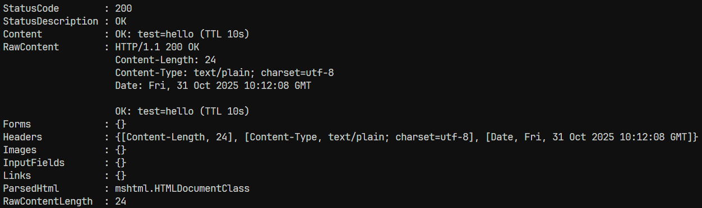
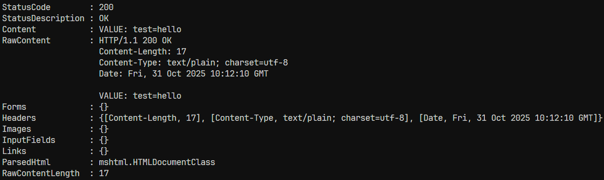
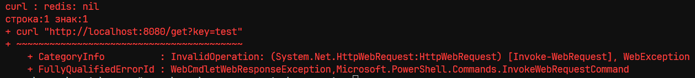

# Практическая работа № 7
Студент: Юркин В.И.
Группа: ПИМО-01-25

Тема: Подключение и работа с Redis (SET/GET, TTL). Реализация простого кэша.

Цели:
- Освоить базовые операции работы с Redis из Go-приложения.
- Научиться использовать команды SET, GET, EXPIRE и механизм TTL.
- Реализовать кэширование данных для ускорения работы API.
- Понять, как кэш помогает снизить нагрузку на основную базу данных.

Redis (Remote Dictionary Server) — это высокопроизводительное хранилище данных в оперативной памяти, работающее по принципу ключ–значение.
Доступ к данным осуществляется за милли- или микросекунды. Redis поддерживает различные типы данных: строки, списки, множества, хэши и упорядоченные множества.

Главные особенности:
- Хранение данных в оперативной памяти.
- Поддержка механизма TTL (time-to-live) — автоматического удаления ключей по истечении времени жизни.
- Возможность использования как кэша, брокера сообщений или временного хранилища.

## Скриншоты

### 1. Установка значения
```bash
curl "http://localhost:8080/set?key=test&value=hello"
```
Результат:



### 2. Получение значения
```bash
curl "http://localhost:8080/get?key=test"
```
Результат:



### 3. Получение ttl
```bash
curl "http://localhost:8080/ttl?key=test"
```
Результат:


### 4. Получение значения после истечения ttl
```bash
curl "http://localhost:8080/get?key=test"
```
Результат:



## Установка
Установка зависимостей
```bash
make install
```

### Отладка
Запуск Redis
```bash
docker run --name redis -p 6379:6379 redis
```
Запуск сервера в режиме разработки
```bash
make run
```


